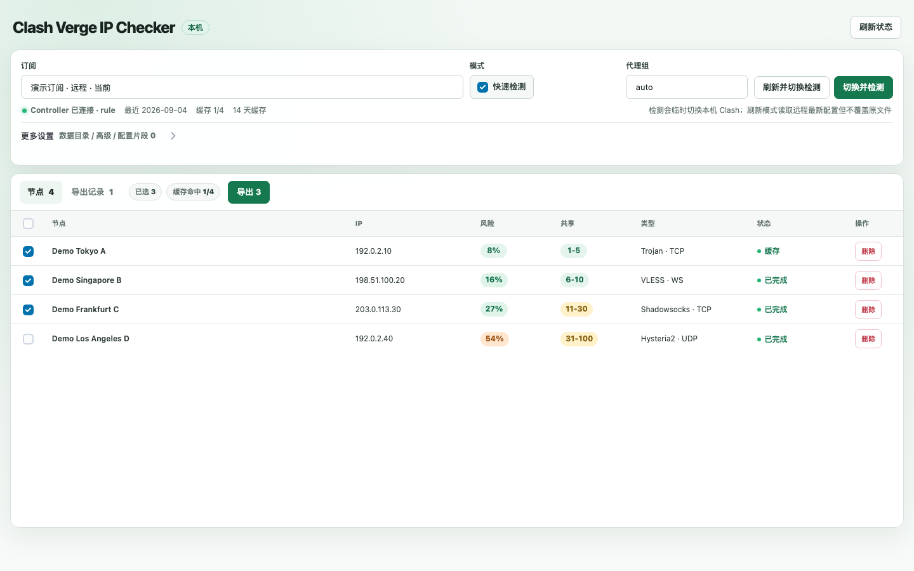
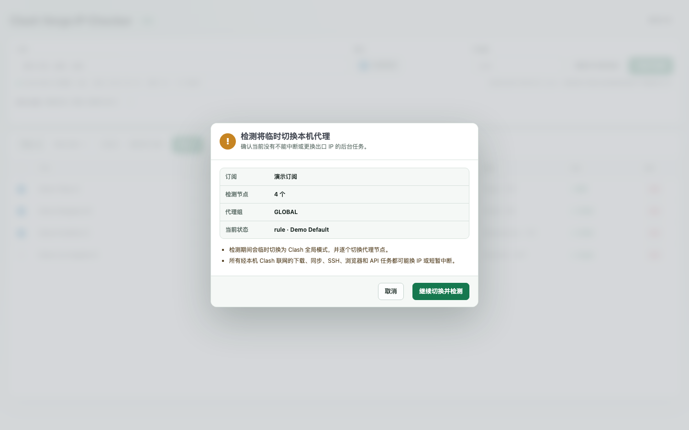

# Clash Verge IP Checker Auto

[English](README.md) | [简体中文](README.zh-CN.md)

A local node cleanup helper for Clash Verge Rev. It reads local profiles, checks exit IP quality, exports a new checked YAML, and gives you an import link for adding the result back to Clash Verge.

This is a personal adaptation of [tombcato/clash-ip-checker](https://github.com/tombcato/clash-ip-checker). This version is shaped around the Clash Verge Rev workflow I needed: read the local config automatically, filter risky nodes before export, and leave the final activation step for manual review.

Use it on your own machine or a trusted LAN. Do not expose it to the public internet.

## Preview

These screenshots use only demo profiles, demo nodes, and documentation-reserved IP addresses. They contain no real subscriptions, nodes, secrets, or network data.



Before a check starts, the UI explains the host-wide network impact and lets the user cancel:



## Main Differences From The Original Project

- Reads the local Clash Verge Rev config directly instead of asking you to paste subscription YAML into the page.
- Finds the Clash Verge Rev data directory, `profiles.yaml`, subscription YAML files, External Controller address, and existing local secret.
- Shows checkable Remote / Local main profiles by default; Merge, script, rules, and other fragments stay folded separately.
- IPPure fast check does not use the original project's check endpoint, and Ping0/Fallback is not enabled.
- Exports a new checked YAML without overwriting the original subscription, editing `profiles.yaml`, or enabling the new subscription automatically.
- Mobile subscription URL/QR code is generated only in LAN launch mode; it is just an import path for exported YAML, not a way to start the service.
- LAN mode is for trusted devices to download this computer's exported YAML. There is no login layer and it is not for public hosting.
- Stores local node observations in SQLite at `data/results.sqlite3` and successful IP reputation results in the syncable `sync/ip_reputation_cache.json`; the same exit IP can reuse a result for 14 days.
- Selects only completed nodes with risk scores at or below 30% by default; pending, failed, unknown, and higher-risk nodes stay unselected.
- Deduplicates by exit IP and keeps an exported-file list to reduce repeated nodes and manual filtering.

## What It Does

- Reads Clash Verge Rev `profiles.yaml` and YAML files under `profiles/`.
- Uses Clash External Controller to switch mode and selected proxy while checking nodes.
- Checks node exit IP quality with IPPure fast checks by default.
- Optionally uses browser-based IPPure checks for slower but richer information.
- Exports a new `*_checked.yaml` under local `exports/`.
- Generates a `clash://install-config` import link; in LAN launch mode, it also generates a mobile subscription URL/QR code for importing exported YAML.

## Safety Boundaries

- It does not overwrite existing Clash Verge profile files.
- It does not directly edit `profiles.yaml`.
- It does not call Clash Verge internal Tauri IPC.
- It does not automatically replace or activate the current subscription.
- The imported checked subscription must be reviewed and enabled manually in Clash Verge.
- Before checking, the UI verifies the External Controller and shows a confirmation dialog describing the host-wide network impact.
- During checking, it uses Clash External Controller to temporarily change Clash mode and selected nodes. Completion, stop, and error paths restore the previous selected proxies and mode before releasing the task lock.
- When checking a non-current profile with temporary loading enabled, it temporarily reloads the Clash core config, then restores the runtime config, selected proxies, and mode in that order.

The final activation step stays in Clash Verge. Enabling or replacing a subscription changes real traffic routing, so this tool does not do it automatically.

## Requirements

- Python 3.10+.
- Clash Verge Rev installed.
- Clash Verge Rev running while checks are performed.
- Clash Verge Rev External Controller enabled.
- The selected profile must be a local YAML-backed Remote or Local main profile.

## Prepare Clash Verge Rev

1. Open Clash Verge Rev.
2. Open its settings page.
3. Find the Clash/Mihomo core settings area.
4. Enable External Controller or HTTP controller if your version exposes that switch.
5. Keep the controller bound to localhost when possible, for example `127.0.0.1:9097`.
6. If your controller uses a secret, keep it local. Do not paste that secret into GitHub issues, chat, screenshots, or public logs.

UI labels vary between Clash Verge Rev versions. If the app already has an `external-controller` value in its local `config.yaml`, this tool will read that value automatically.

The API secret field is only a fallback. If the secret already exists in the local Clash Verge config, the backend reads it locally and does not show it in the UI.

## Quick Start

### macOS

```bash
./run_mac.command
```

The script requires Python 3.10+, creates or repairs `.venv` when needed, and
installs dependencies only for a new or unhealthy environment or after
`requirements.txt` changes. It then starts the local web UI. Port 8080 remains
the default; when it is occupied by another program, the launcher selects the
first free port in `18080-18120`, stores it in ignored local runtime state, and
reuses it on later launches. The terminal prints and opens the actual URL, for
example:

```text
http://127.0.0.1:8080
```

### Windows

```bat
run_windows.bat
```

The Windows launcher follows the same environment, dynamic-port, and
dependency-fingerprint checks before it starts the local web UI and opens the
actual selected URL, for example:

```text
http://127.0.0.1:8080
```

### Manual Start

```bash
python3 -m venv .venv
.venv/bin/python -m pip install -r requirements.txt
.venv/bin/python web.py
```

The manual entry uses the same persisted port selection. Open the URL printed
by the process, for example:

```text
http://127.0.0.1:8080
```

If you use browser-based checks, install the Chromium runtime for Playwright:

```bash
.venv/bin/python -m playwright install chromium
```

Fast mode does not require launching Playwright Chromium.

Local Project Center uses the repository-owned lifecycle entry directly:

```bash
./scripts/project_center_service status
./scripts/project_center_service start
./scripts/project_center_service restart
./scripts/project_center_service stop
```

`status` never installs dependencies. Lifecycle actions stop a listener only
after its port, working directory, command marker, and application response are
verified as this repository's service.

Set `CLASH_CHECKER_PORT` to require one specific port. An explicit port is never
silently replaced; startup fails safely when that port belongs to another
process. Automatic fallback applies only when the variable is unset.

## Basic Workflow

1. Start Clash Verge Rev.
2. Make sure External Controller is enabled.
3. Start this tool.
4. Pick a supported Remote or Local main profile.
5. Keep `proxy group` as `auto` first.
6. Click `Switch and check`, review the network-impact summary, and continue only when other host tasks can tolerate an IP change.
7. If auto proxy-group detection fails, enter the real Clash proxy group name, such as `GLOBAL`, `Proxy`, `PROXY`, or the selector name used by your profile.
8. Review the checked node list and selected nodes.
9. Click `Export selected`.
10. On the first export, choose `Import to Clash Verge for the first time` in the dialog.
11. Later exports overwrite the same checked YAML. When the matching Clash Verge profile already exists, the page will not start another install; refresh the existing checked profile in Clash Verge instead.
12. After the first import, open Clash Verge and manually review, select, or enable the checked profile.

The mobile subscription URL/QR code is generated only in LAN launch mode. A normal localhost launch will not show a mobile-usable QR code. Mobile clients only import YAML exported by this computer; they do not start this tool.

For Remote profiles, `Refresh source and check` downloads the latest remote YAML into memory, checks it, and exports a checked YAML. It does not write back to the original subscription file.

Both check actions confirm the node's current exit IP over HTTPS before reusing a successful reputation result for that IP for up to 14 days. To force a fresh IPPure lookup, enable `Ignore 14-day IP cache` under Advanced; duplicate exit IPs are still queried only once within the same task.

## LAN Access

Use LAN mode only for trusted devices on the same network that need to open this computer's checker UI or download its generated YAML.

On macOS:

```bash
./run_lan_mac.command
```

On Windows:

```bat
run_lan_windows.bat
```

LAN mode binds the web server to `0.0.0.0` and tries to detect the current LAN IP, such as:

```text
http://192.168.1.23:8080
```

If auto-detection chooses the wrong address, set it manually before starting:

```bash
CLASH_CHECKER_PUBLIC_BASE_URL=http://192.168.1.23:8080 ./run_lan_mac.command
```

When setting `CLASH_CHECKER_PUBLIC_BASE_URL` manually, its port must match the
selected service port. Set both variables when a fixed LAN address is required.

Important LAN boundaries:

- The LAN page operates the service running on this computer.
- The tool reads this computer's Clash Verge files and controls this computer's Clash External Controller.
- Other users cannot use your LAN page to read or control Clash Verge on their own computer.
- To process another computer's Clash Verge installation, run this tool on that computer.
- Do not expose this service to the public internet. It has no login layer.
- If macOS or Windows Firewall prompts for Python network access, allow it only on a trusted LAN.

## Local Data and Privacy

This tool reads local Clash Verge profile metadata and profile YAML contents. Generated data stays local by default:

- Exported YAML files are written to `exports/`.
- Local profile and node observations are stored in `data/results.sqlite3`.
- Successful IP reputation results are stored locally in `sync/ip_reputation_cache.json`. Because the file contains exit IPs and check times, Git ignores it. The public repository keeps only the empty `sync/ip_reputation_cache.example.json` template.
- Temporary runtime files may be written under `.runtime/`.

These paths are ignored by Git in this repository:

```gitignore
exports/
data/
.runtime/
.venv/
sync/ip_reputation_cache.json
```

Before publishing or pushing a fork, run:

```bash
git status --short --ignored
git ls-files exports data .runtime sync/ip_reputation_cache.json
git log --all -- sync/ip_reputation_cache.json
```

Before publication, generated exports, local SQLite databases, temporary runtime files, and the real IP cache must not appear in `git ls-files`. The `git log` command must not show older commits of the real cache either. Emptying the current file or adding an ignore rule does not clean Git history; rewrite that history or publish from an audited clean history.

Do not commit:

- Clash Verge `profiles.yaml`.
- Subscription YAML files from your real provider.
- Exported checked YAML files.
- `data/results.sqlite3`.
- API secrets, provider URLs, tokens, or screenshots that reveal subscription names or URLs.

The local IP cache contains no profile names, node names, node configuration, or secrets, but exit IPs and check times are still private host-network data. If the cache JSON is invalid, the app preserves it without overwriting it and continues saving node results to local SQLite.

## License and Attribution

This repository follows GPL-3.0. See [LICENSE](LICENSE).

The code is adapted from [tombcato/clash-ip-checker](https://github.com/tombcato/clash-ip-checker). Original authors and contributors keep copyright over their original work; changes in this repository are maintained here.

This is not an official upstream release. See [NOTICE](NOTICE) for attribution details.

## UI Notes

- The subscription list only shows selectable Remote and Local main profiles by default.
- Merge, script, rules, and other unsupported profile fragments are shown under the collapsed fragment section because they are not complete node subscriptions.
- Fast check mode discovers the IPv4 exit over HTTPS and prefers a SOCKS5 IPv4 path through Clash mixed-port for IPPure; the returned address must match the preflight IPv4.
- If IPPure still returns IPv6 or omits the risk score, the page reports `IPv6 unscored` or `exit mismatch` and does not auto-select that node as low risk.
- The page prefers the latest successful result within 14 days for the node's last confirmed IP instead of limiting the view to the profile's latest check date.
- Turning fast check off uses the browser-based checker, which is slower but can collect bot-score style data.
- Export selection defaults to nodes with a completed risk score at or below 30%.
- Pending, failed, unknown, and risk greater than 30% nodes are not selected by default.
- The visible node list is deduplicated by concrete exit IP. Empty, pending, unknown, and N/A IP values are not deduplicated.

## Troubleshooting

### No profiles found

- Confirm Clash Verge Rev is installed.
- Confirm the app has been opened at least once.
- If your data directory is custom, enter it in the UI or set `CLASH_VERGE_HOME`.

### Cannot connect to Clash External Controller

- Start Clash Verge Rev.
- Enable External Controller or HTTP controller in Clash Verge Rev settings.
- Confirm the controller address shown in this tool matches your Clash config.
- If a secret is configured, either let the tool read it locally or enter it in the API secret field.

### Auto proxy group detection fails

Enter the selector/proxy group name manually. The group must be the group that Clash can switch to each node during checking.

### Imported subscription is not active

This is expected. Import creates a new checked subscription, but Clash Verge may not auto-select it. Open Clash Verge and manually select or enable the checked subscription after reviewing it.

### Should I import again after another export?

No. The project overwrites the stable `*_checked.yaml` file and checks whether Clash Verge already has a profile pointing to that file. Refresh the existing profile in Clash Verge. Re-running the install-config action appends another profile instead of replacing the old one. If duplicates already exist, keep one and remove the others manually in Clash Verge.
